## Provenance Guard -- planning.md

Text is taken through a initial parser that scans for malicious prompts and filters out harmful attempts at prompt injection before transferred to the signal tools through POST /submit. The tool will classify based on type of text (e.g. poem, short story, blog post, novel, news, etc.) and weigh the confidence on each of the signals, average it down the asymmetric weightages of each signal, apply a transparency label when AI confidence exceeds 70% or human confidence exceeds 60%, an uncertain label for anything in between or whenever the two signals disagree, alongside a confidence score (0-1.00). Every attribute decision will be logged in the audit log with fields for attribution, confidence score, signals used, any requests for appeals, endpoints used (in order of usage).

The appeals workflow will submit to POST/ appeal endpoint and update status to under review, log it in the audit log and send a reponse to user- "Request under review. Please check back later."

---
## Detection signals

**LLM-based classification:** GROQ evaluates the *meaning and flow of logic* of the text including coherence, argument progression, factual consistency, and topical depth to produce an attribution, a confidence score (0–1.00), and a transparency label. This classification is strictly **semantic**, never structural: it must ignore punctuation, formatting, and surface grammar (those are handled by the Stylometric signal) to avoid double-counting the same evidence. The prompt is genre-aware (poem / short story / blog / novel / news), since "good logical flow" means different things per genre. Output is constrained to a strict JSON schema (`attribution`, `confidence`, `rationale`, `genre`) so it can be averaged with other signals. Low-confidence or refusal responses fall back to `uncertain` rather than guessing.

**Stylometric Heuristics:** Each is a cheap regex/stat computation (no model call), making it a fast complement to GROQ. Thresholds are calibrated per genre (set after classification). These tools will measure:
- Punctuation
    - the grammar used
    - looking for em dashes (high em-density/1k words => AI)
    - Unicode (AI) vs ASCII (human) characters like curly and straight apostrophes
    - AI is >95% consistent with 
        - Oxford comma consistency
        - Spacing regularity
        - Clean ellipsis form
- Sentence & paragraph structure
    - sentence length invariance (--> AI)
    - paragraph length uniformity (--> AI)
    - sentence opener diversity (lack of --> AI) measured by distinct first-word/first-bigram ratio
- Lexical structure
    - type-token ratio / vocabulary richness
    - function-word frequency distribution (Burrows's Delta style: *the, of, and, to, that, it*)
    - hapax legomena rate (words appearing once; higher --> human)
    - average word length / syllable count (longer, more Latinate --> AI)
- Formatting artifacts
    - unprompted markdown scaffolding: bullets, **bold lead-ins:**, headers, numbered lists (--> AI)
    - list-item grammatical parallelism (rigid --> AI)
- Repetition & rhythm
    - n-gram repetition of connective phrases ("it's important to note", "plays a crucial role") (--> AI)
    - bigram/trigram self-similarity across the document
    - transition-word density (high --> AI)
- Error signature (often strongest)
    - typo / misspelling rate (near-zero --> AI)
    - grammatical-imperfection rate: comma splices, fragments, tense drift (present --> human)
    - internal inconsistency: mixed US/UK spelling, mid-document formatting shifts (present --> human)

**Design notes:**
- Per-genre calibration is required (a poem is bursty + clean by design; a blog tolerates markdown).
- The em-dash signal is popular but easily defeated by find-replace and prone to false positives, weighed as low signal
- All features degrade gracefully on short text where LLM classification is shaky, and produce a single normalized stylometric confidence (0–1.00) to feed the weighted average.

## Uncertainty representation
Each signal outputs a P(AI) score from 0 to 1.00 (`llm_score`, `stylo_score`). The two are combined through an agreement gate before they get banded into a label, so conflicting signals never produce false confidence.
- agreement gate: `gap = |llm_score - stylo_score|`
    - `gap <= 0.25` (signals agree): `combined = mean(llm_score, stylo_score)`, confidence reported as-is
    - `gap > 0.25` (signals disagree): force uncertain regardless of the mean, since our signals are conflicting
- bands, asymmetric so a tie favors the creator (a false positive is worse than a false negative here)
    - `combined >= 0.70` and signals agree: Likely AI
    - `combined <= 0.40`, i.e. P(human) >= 0.60: Likely human
    - anything else: Uncertain
- what a 0.6 means: P(AI) = 0.60 sits below the 0.70 AI bar, so it labels Uncertain (leaning AI), not AI. A 0.95 clears the bar and gives a confident AI label, so 0.51 and 0.95 land in genuinely different places
- genre calibration: genre is detected first, then the stylometric thresholds (burstiness, markdown tolerance, typo expectations) are picked per genre before scoring, so a clean poem is not auto-flagged as AI
- validation: run the 4 test inputs (clear-AI, clear-human, formal-human, edited-AI), print `llm_score` and `stylo_score` separately, and confirm the bands hold and the edited-AI case lands in uncertain through the gate

## Transparency label design
Neutral and non-accusatory, with the confidence percentage shown so a non-technical reader can weigh it.

**Highly confident human:** (P(AI) <= 0.40)
> "This text reads as human-written (confidence: {pct}%). No strong AI-generation signals were detected."

**Highly confident AI:** (P(AI) >= 0.70 and both signals agree)
> "This text shows signals commonly associated with AI generation (confidence: {pct}%). This is an automated estimate, not a verdict. If you wrote it yourself, you can appeal."

**Uncertain:** (between the bands, or the signals disagree)
> "Attribution uncertain (confidence: {pct}%). Our signals were mixed or inconclusive for this text, so treat its origin as unconfirmed."

## Appeals workflow
A creator who disputes a classification can contest it, which flags the content for human review without any automated re-classification.
- who: the content creator (the `creator_id` on the original submission)
- provides: `content_id` and `creator_reasoning` (free text)
- system does: look up `content_id`, set status to "under_review", append an appeal entry to the audit log next to the preserved original decision (original attribution, confidence, both signal scores), and return "Request under review. Please check back later."
- reviewer view (appeal queue): all entries with `status = under_review`, showing the original text, `llm_score`, `stylo_score`, combined confidence, the label shown, `creator_reasoning`, and timestamps
- no automated re-classification, a human makes the final call

## Anticipated edge cases
- non-native formal writer: clean grammar, low typo rate, and uniform structure, so stylometry false-positives it as AI. mitigated by the higher AI bar plus appeals, and GROQ may rescue it through genuine lived-experience cues
- repetitive simple-vocab poem: low type-token ratio, high n-gram repetition, and uniform line length, so the heuristics read it as AI. mitigated by genre-aware calibration (poem thresholds)
- lightly-edited AI output: a human breaks the surface tells and adds typos but the semantic flow stays AI, so stylometry says human while GROQ says AI and the gate forces uncertain. the honest outcome, and a demo of why gating beats a flat average
- very short text (under ~50 words): both signals get unreliable, so it defaults to uncertain

## Architecture
Submission flow: raw text enters `POST /submit`, passes the prompt-injection filter, gets a genre from the classifier, then both signals score it in parallel. The scores go through agreement-gated scoring, the label generator turns the combined score into label text, the decision is written to the audit log, and the JSON response goes back to the caller. Appeal flow: `POST /appeal` looks up the content by id, sets its status to under_review, appends to the audit log, and returns a confirmation.

```mermaid
flowchart TD
    subgraph Submission
        C1([client]) -->|raw text + creator_id| S[POST /submit]
        S -->|raw text| F[prompt-injection filter]
        F -->|clean text| G[genre classifier]
        G -->|text + genre| LLM[GROQ semantic signal]
        G -->|text + genre| STY[stylometric signal]
        LLM -->|llm_score| SC[agreement-gated scoring]
        STY -->|stylo_score| SC
        SC -->|combined score + band| L[label generator]
        L -->|label text + confidence| AL1[(audit log)]
        AL1 -->|attribution, confidence, label| R1([JSON response])
    end

    subgraph Appeal
        C2([client]) -->|content_id + creator_reasoning| A[POST /appeal]
        A -->|content_id| LU[lookup content, set status = under_review]
        LU -->|appeal + original decision| AL2[(audit log)]
        AL2 -->|confirmation| R2(["JSON response<br/>Request under review..."])
    end
```

## AI Tools Plan
For each implementation milestone: which spec sections to hand the AI tool, what to ask it to generate, and how to verify the output before wiring it in.
- M3 (submission endpoint + first signal): provide the Detection signals section + the architecture diagram. ask for the Flask app skeleton with the `POST /submit` stub, the GROQ signal function, the audit-log writer, and a `GET /log` endpoint. verify the signal function standalone on a few inputs, then curl `/submit` and inspect the JSON.
- M4 (second signal + confidence scoring): provide Detection signals + Uncertainty representation + the diagram. ask for the stylometric signal function and the agreement-gated scoring logic. verify the 4 test inputs land in distinct bands, printing `llm_score` and `stylo_score` separately to catch a misbehaving signal.
- M5 (production layer): provide Transparency label design + Appeals workflow + the diagram. ask for the label-generation function, the `POST /appeal` endpoint, and Flask-Limiter setup. verify all 3 labels are reachable, an appeal flips status to under_review, and a 12-request loop returns 429s after the limit.